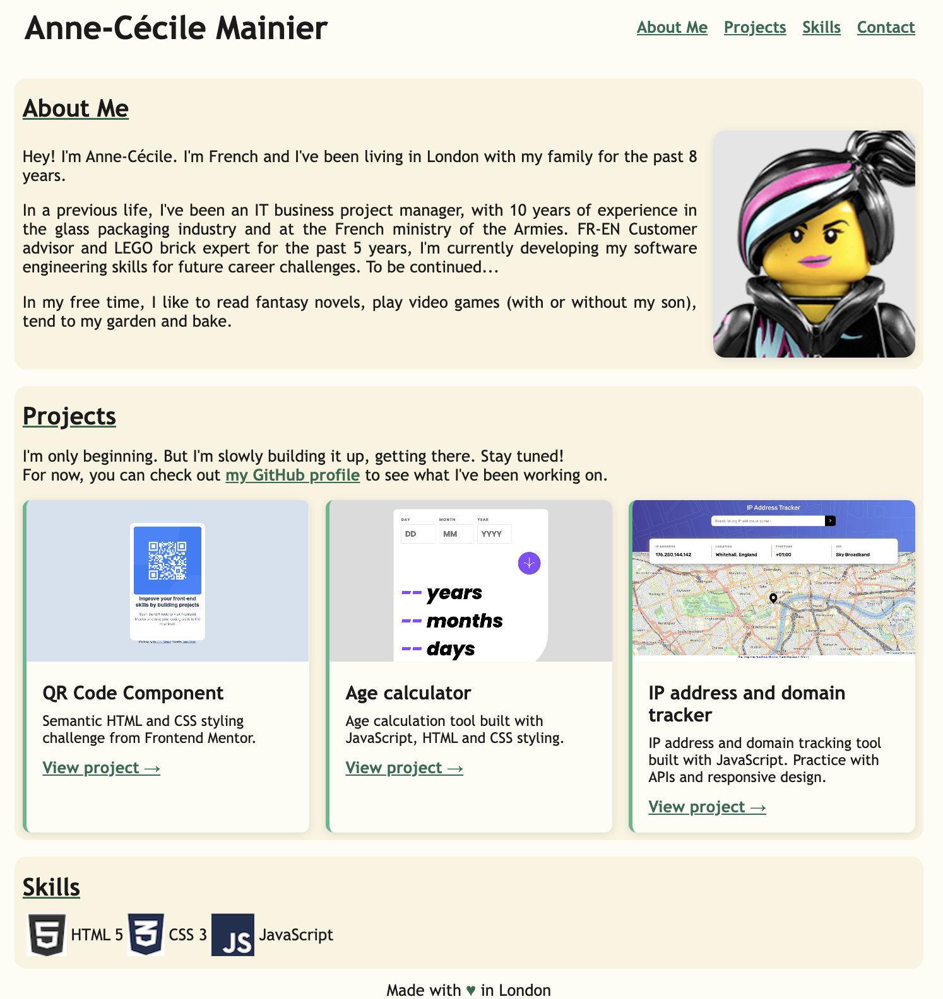

# Portfolio Project

This is my genuine portfolio website, along with the submission to the challenge Week 1 of the skills Bootcamp in Full Stack Web Development, organized by Step8Up Ltd.

## Overview

### Screenshot

### Link

- URL: [https://github.com/acmainier/portfolio](https://github.com/acmainier/portfolio)

## Built with

- Semantic HTML5 markup
- CSS custom properties
- Flexbox

## Author

- Github - [Anne-Cécile Mainier](https://github.com/acmainier)
